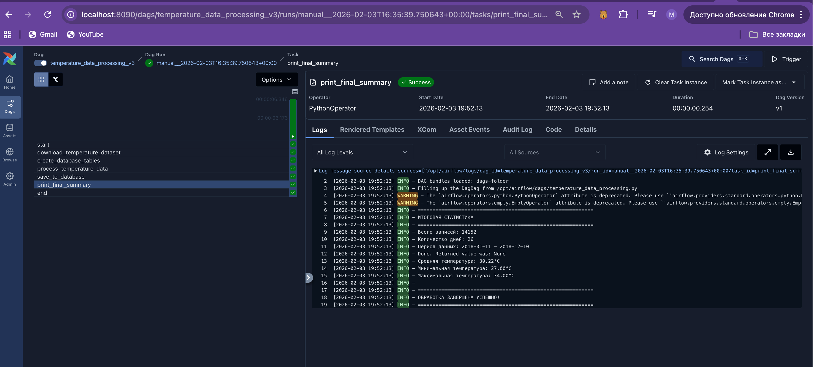

Файл нового дага - dz1/dags/tem

Я решил не менять, так как аирфлоу уже настроен на чтение оттуда
Также я теперь собираю с докера, так как в образе не было библиотеки кагла
после выполнения дага получился такой вывод из БД

airflow_db=# select * from temperature_extremes;
 id |    date    |    temperature     | type | rank |         created_at         
----+------------+--------------------+------+------+----------------------------
  1 | 2018-11-10 |                 34 | hot  |    1 | 2026-02-03 16:52:12.424203
  2 | 2018-12-10 |  33.48979591836735 | hot  |    2 | 2026-02-03 16:52:12.424203
  3 | 2018-11-08 |  32.89922480620155 | hot  |    3 | 2026-02-03 16:52:12.424203
  4 | 2018-03-09 | 32.017357762777245 | hot  |    4 | 2026-02-03 16:52:12.424203
  5 | 2018-09-10 |  31.95774647887324 | hot  |    5 | 2026-02-03 16:52:12.424203
  6 | 2018-06-09 | 27.411167512690355 | cold |    1 | 2026-02-03 16:52:12.424203
  7 | 2018-05-09 |  27.88888888888889 | cold |    2 | 2026-02-03 16:52:12.424203
  8 | 2018-04-12 | 28.119230769230768 | cold |    3 | 2026-02-03 16:52:12.424203
  9 | 2018-06-12 | 28.267123287671232 | cold |    4 | 2026-02-03 16:52:12.424203
 10 | 2018-10-08 | 28.601739130434783 | cold |    5 | 2026-02-03 16:52:12.424203
(10 строк)

airflow_db=# 

и такой лог

[2026-02-03 19:52:13] INFO - ============================================================
[2026-02-03 19:52:13] INFO - ИТОГОВАЯ СТАТИСТИКА
[2026-02-03 19:52:13] INFO - ============================================================
[2026-02-03 19:52:13] INFO - Всего записей: 14152
[2026-02-03 19:52:13] INFO - Количество дней: 26
[2026-02-03 19:52:13] INFO - Период данных: 2018-01-11 - 2018-12-10
[2026-02-03 19:52:13] INFO - Done. Returned value was: None
[2026-02-03 19:52:13] INFO - Средняя температура: 30.22°C
[2026-02-03 19:52:13] INFO - Минимальная температура: 27.00°C
[2026-02-03 19:52:13] INFO - Максимальная температура: 34.00°C
[2026-02-03 19:52:13] INFO - 
[2026-02-03 19:52:13] INFO - ============================================================
[2026-02-03 19:52:13] INFO - ОБРАБОТКА ЗАВЕРШЕНА УСПЕШНО!
[2026-02-03 19:52:13] INFO - ============================================================

Доказательство - на фото

