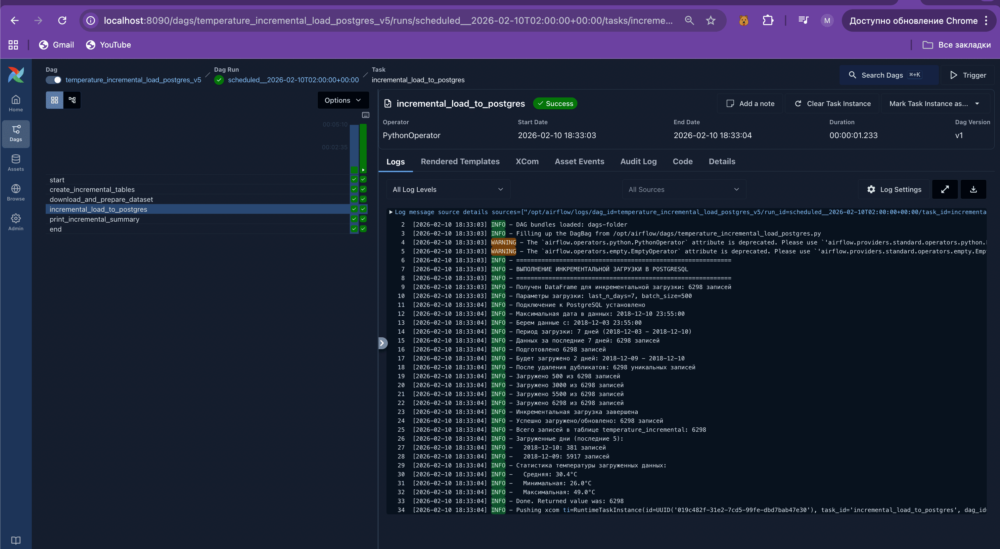

Файл аналитики (еще я в нем отлаживался) в этой папке. Даги - 

[Полная загрузка](https://github.com/Zhmikhail/HSE_ETL/blob/main/dz1/dags/temperature_full_load_postgres.py)

[Инкрементальная загрузка](https://github.com/Zhmikhail/HSE_ETL/blob/main/dz1/dags/temperature_incremental_load_postgres.py)

Вот лог аирфлоу - даги залетели без ошибок

Bundle       File Path                                 PID    Current Duration      # DAGs    # Errors  Last Duration    Last Run At
airflow   | -----------  ----------------------------------------  -----  ------------------  --------  ----------  ---------------  -------------------
airflow   | dags-folder  temperature_full_load_postgres.py                                           1           0  0.22s            2026-02-10T15:38:27
airflow   | dags-folder  temperature_incremental_load_postgres.py                                    1           0  0.22s            2026-02-10T15:38:30
airflow   | dags-folder  temperature_data_processing.py                                              1           0  0.21s            2026-02-10T15:38:38
airflow   | dags-folder  parasha.py                                                                  1           0  0.03s            2026-02-10T15:38:29

фото как работает один из дагов

